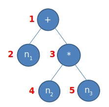

<!-- _class: first -->

# Matéria
## &aula
### Professor
#### &semestre

---

# Objetivos de Aprendizagem

1. Etc

---
# Exemplo Figura


---

<!-- _class: double -->

# Exemplo Double

$$ n_1 + n_2 * n_3 $$


Cada nó pede para que cada filho interprete a sua parte recursivamente.

Exemplo ao lado:

#1: Resolve aí #2
#2: Retorno $n_1$ para #1
#1: Resolve aí #3
#3: Resolve aí #4
#4: Retorno $n_2$ para #3
#3: Resolve aí #5
#4: Retorno $n_3$ para #3
#3: Retorno $n_2$ * $n_3$ para #1
#1: Retorno $n_1$ + $n_2$ * $n_3$ para meu **pai**

---

# Exemplo Code

```julia

function soma(x::Int, y::Int)::Int
  local a::Int
  a = x + y
  println(a)
  return a
end

local a::Int
local b::Int
a = 3
b = soma(a, 4)
println(a)
println(b)

```
---

# Bibliografia
<!-- _class: narrow -->

* Compiladores:
  * AHO, A. V.; LAM, M. S.; SETHI, R.; ULLMAN, J., Compiladores: Princípios, Técnicas e Ferramentas, 2ª ed., Longman, 2007
  * JOSÉ NETO, J., Introdução à Compilação., 1ª ed., Elsevier, 2016
* Linguagens Formais e Autômatos:
  * RAMOS, M. V. M.; JOSÉ NETO, J.; VEJA, I. S., Linguagens Formais. Teoria, Modelagem e Implementação, 1ª ed., Bookman, 2009
  * HOPCROFT, J. E.; ULLMAN, J. D.; MOTWANU, R., Introdução à Teoria dos Autômatos, Linguagens e Computação, 1ª ed., CAMPUS, 2002
* Computabilidade e Lógica:
  * BOOLOS, G. S.; BURGESS, J. P.; JEFFREY, R. C., Computabilidade e Lógica, 1ª ed., Unesp, 2012
  * SILVA, F. C.; FINGER, M.; MELO, A. C. V., Lógica para Computação, 2ª ed., Cengage, 2017
* Complexidade:
  * CORMEN, T. H.; LEISERSON, C. E.; RIVEST, R. L.; STEIN, C., Algoritmos: teórica e prática., 3ª ed., Elsevier-Campus., 2012
  * SIPSER, M., Introdução à Teoria da Computação, 2ª ed., Thomson Pioneira, 2007
